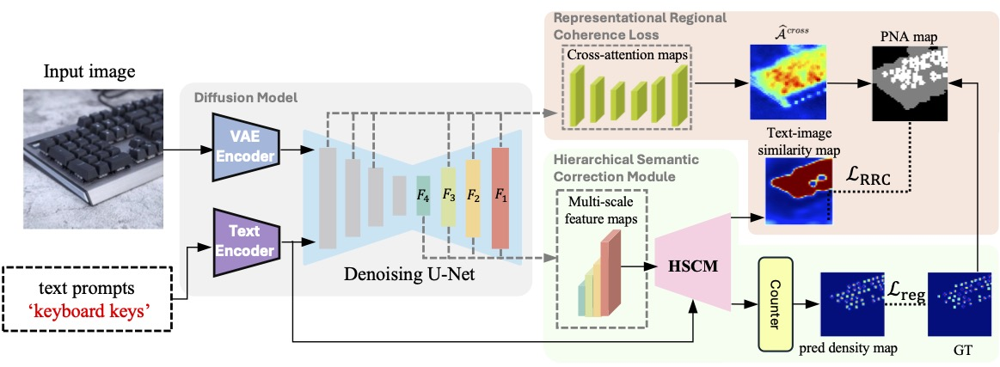

# T2ICount: Enhancing Cross-modal Understanding for Zero-Shot Counting
## [Paper (ArXiv)](https://arxiv.org/abs/2502.20625) 

Official Implementation for CVPR 2025 paper T2ICount: Enhancing Cross-modal Understanding for Zero-Shot Counting.


## Preparation

**Environment:** Create a virtural environment use Anaconda, and install all dependencies.
```
conda env create -f environment.yaml
```
**Data:** We conduct experiments over three datasets, you can download and use whichever you would like to test.
The three dataset could be downloaded at: [FSC-147](https://github.com/cvlab-stonybrook/LearningToCountEverything) | [CARPK](https://lafi.github.io/LPN/).
Notice that you have to download the annoations of FSC-147 separately from [their repo](https://github.com/cvlab-stonybrook/LearningToCountEverything/tree/master/data).

Extract and put the downloaded data in the `data/` dir. The complete file structure should look like this. You don't have to download all the dataset for evaluation, but you must have FSC-147 if you want to train the model. 
```
data
├─CARPK/
│  ├─Annotations/
│  ├─Images/
│  ├─ImageSets/
│
├─FSC/    
│  ├─gt_density_map_adaptive_384_VarV2/
│  ├─images_384_VarV2/
│  ├─FSC_147/
│  │  ├─ImageClasses_FSC147.txt
│  │  ├─Train_Test_Val_FSC_147.json
│  │  ├─ annotation_FSC147_384.json
```
**Stable Diffusion:** Our model is developed by fine-tuning Stable Diffusion v1.5, whose original weights can be downloaded from [here](https://huggingface.co/stable-diffusion-v1-5/stable-diffusion-v1-5/blob/main/v1-5-pruned-emaonly.ckpt).
Please put the downloaded weight file in the `configs/` dir.

## FSC-147-S-v2
During the review process, the reviewers raised concerns regarding the dataset. In response, we conducted a thorough reassessment and introduced a revised version, which we named FSC-147-S-v2. This updated version includes an additional set of images, bringing the total to 230. As a result, the statistics of v2 differ from those originally reported in the paper. In this new subset, the objects originally annotated in these images from FSC-147 had an average count of 44.98, while the newly annotated objects have an average count of 3.96. The results from the baseline methods and our method are provided here. For the updated dataset (v2), please refer to [**FSC-147-S.json**](https://github.com/cha15yq/T2ICount/blob/main/FSC-147-S.json). As for the original subset used in the paper, you can download it [here](https://github.com/cha15yq/T2ICount/blob/main/asset/FSC-147-S-v1.json). We sincerely apologize for any confusion caused.

| Medthod     |      MAE     |     RMSE     | 
|-------------|--------------|--------------|
| CLIP-Count  |    45.59     |    98.96     | 
| CountX      |    28.67     |    89.18     | 
| VLCounter   |    33.10     |    69.34     | 
| PseCo       |    30.53     |    43.92     | 
| DAVE        |    46.36     |    97.11     | 
| T2ICount (Ours)    |    5.99     |    10.55     | 

We hope that this small subset can serve as an evaluation set to verify whether a model is truly performing zero-shot object counting.

## Run the Code
**Train**. Once you have prepared the data and the pretrained weights of SD1.5, you can train the model using the following command. 

(Tips: You could try 1e-4 for learning rate if you couldn't get nice results with lr=5e-5.)
```
CUDA_VISIBLE_DEVICES=0 python train.py --content exp --crop-size 384 --concat-size 224 --data-dir data/FSC --batch-size 16 --lr 5e-5 --weight-decay 1e-4
```
---
**Evaluation**. 

We provide a [pre-trained ckpt](https://drive.google.com/file/d/1lw5LgpYP7vTazaMWTgNa6nFoZ63j-st9/view?usp=sharing) of our full model, which has similar quantitative result as presented in the paper. 
| FSC val MAE | FSC val RMSE | FSC test MAE |  FSC test RMSE | CARPK MAE | CARPK RMSE |
|-------------|--------------|--------------|----------------|-----------|------------|
| 13.78       | 58.78        | 11.76        | 97.86          | 8.61      | 13.47      |

| FSC S-v2 MAE | FSC S-v2 MSE | 
|--------------|--------------|
| 5.99       | 10.55        |
```
CUDA_VISIBLE_DEVICES=0 python test.py --model-path ./best_model_paper.pth --data fsc147(or carpk) --batch-size 16 --dataset_type FSC --ckpt path/to/model.ckpt
```
---
## Gallery

## Citation
Consider cite us if you find our paper is useful in your research :).
```
@inproceedings{qian2025t2icount,
               title={T2ICount: Enhancing Cross-modal Understanding for Zero-Shot Counting}, 
               author={Qian, Yifei and Guo, Zhongliang and Deng, Bowen and Lei, Chun Tong and Zhao, Shuai and Lau, Chun Pong and Hong, Xiaopeng and Pound, Michael P},
               year={2025},
               booktitle={Proceedings of the IEEE/CVF conference on computer vision and pattern recognition}
}
```
